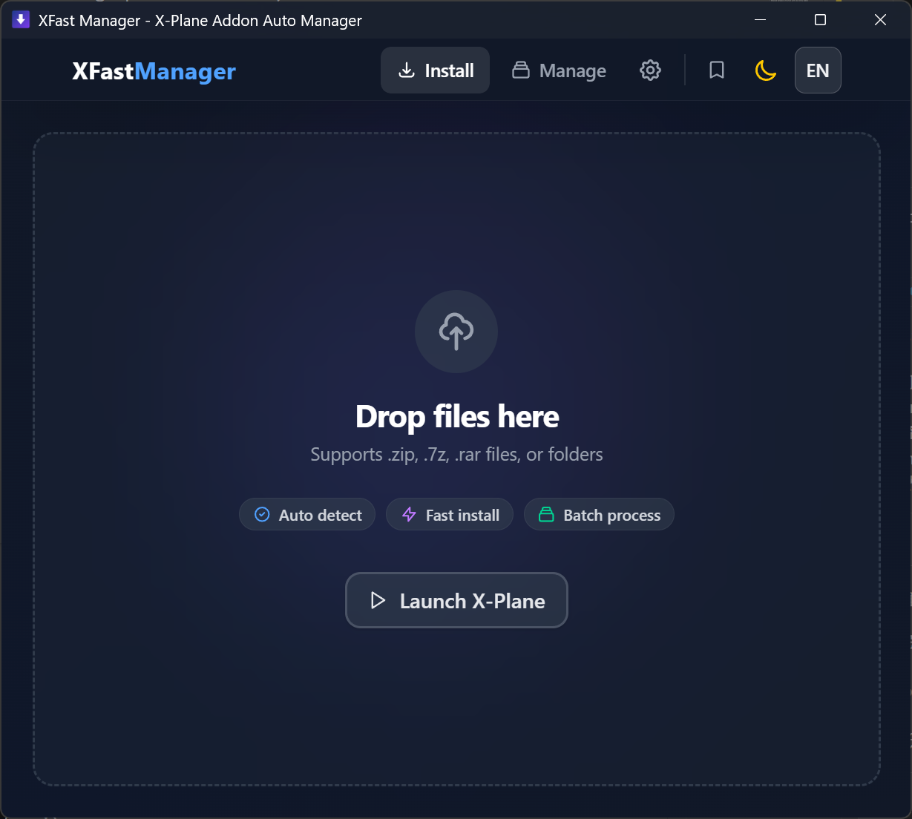
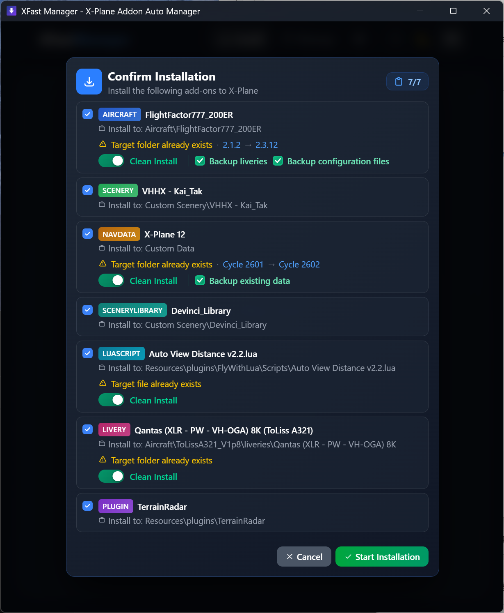
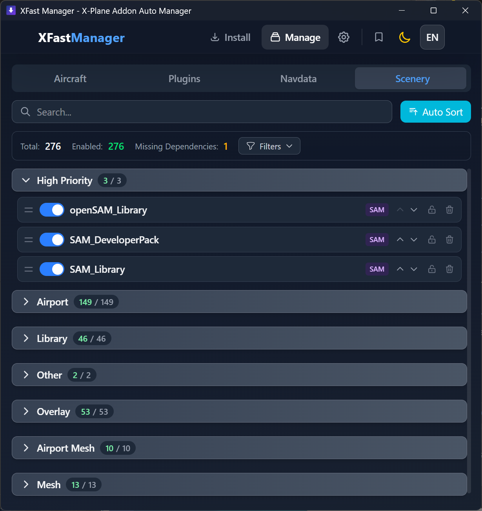
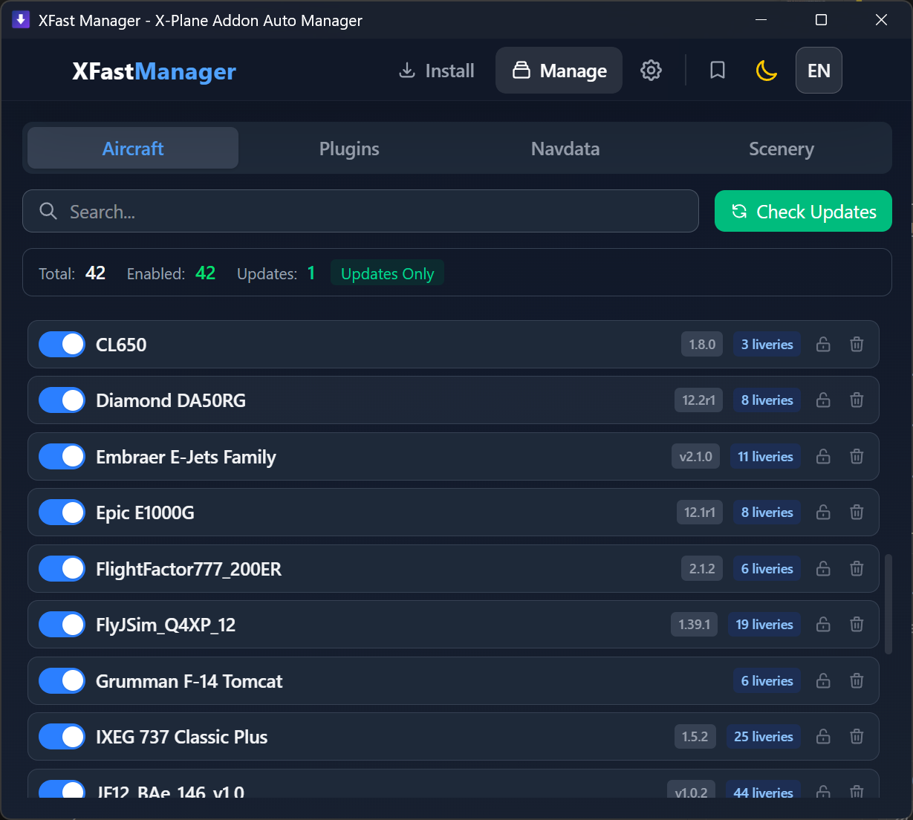
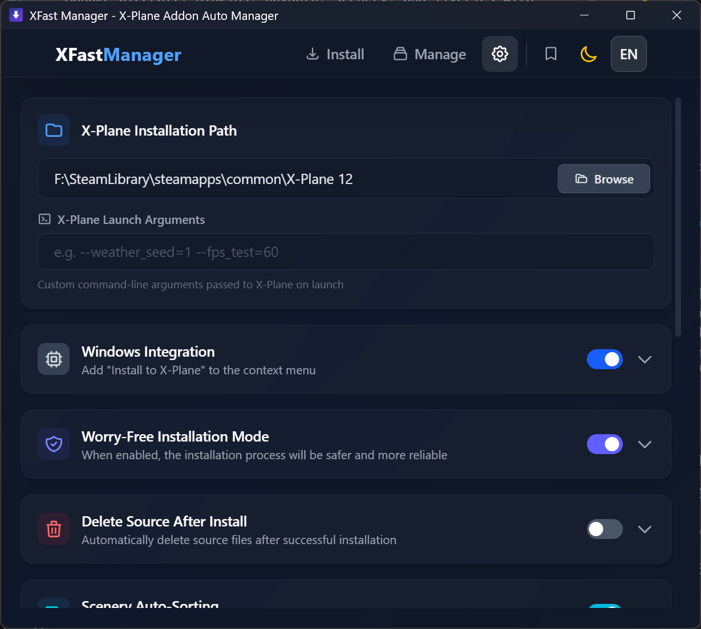

# XFast Manager

<p align="center">
  
</p>

<p align="center">
  <strong>The Modern X-Plane Addon Installer & Manager</strong>
</p>

<p align="center">
  <a href="https://github.com/CCA3370/XFast-Manager/stargazers">
    
  </a>
  <a href="https://github.com/CCA3370/XFast-Manager/issues">
    
  </a>
  <a href="https://github.com/CCA3370/XFast-Manager/commits">
    
  </a>
  <a href="https://github.com/CCA3370/XFast-Manager/releases">
    
  </a>
  <a href="https://img.shields.io/github/downloads/CCA3370/XFast-Manager/total.svg">
    
  </a>
  <a href="https://img.shields.io/badge/Platforms-Windows%20%7C%20macOS%20%7C%20Linux-blue">
    
  </a>
  <a href="LICENSE">
    
  </a>
</p>

<p align="center">
  <a href="https://github.com/CCA3370/XFast-Manager/releases">
    
  </a>
</p>

XFast Manager makes installing and managing X-Plane addons effortless. Drop in a file and get a ready-to-fly setup in minutes. Available for Windows, macOS, and Linux.

---

### Experience at a Glance

- **Install in seconds**: drag and drop any addon file, archive, or folder
- **Zero guesswork**: the app identifies addon types and puts them in the right place
- **Stay organized**: manage aircraft, plugins, navdata, and scenery in one view
- **Safe and reversible**: backups, verification, and clear conflict warnings
- **Polished UI**: light/dark themes, English/Chinese support, smooth progress feedback

### What You Can Do

- Install directly from ZIP, 7z, RAR, or folders without manual extraction
- Manage aircraft, plugins, navdata, scenery, and liveries with quick actions
- Keep scenery load order clean and stable with smart sorting
- See update availability at a glance
- Use a right-click install menu on Windows

### Screenshots







### System Requirements

- Windows 10/11 (x64)
- macOS 10.15+ (Intel or Apple Silicon)
- Linux (x64, GTK3 + WebKit2GTK required)

### Getting Started

1. Download the latest release from the Releases page.
2. Launch the app and select your X-Plane folder.
3. Drag your addon into the window and install.

### FAQ

**Does it support ZIP/7z/RAR archives?**  
Yes. You can install directly from ZIP, 7z, or RAR without extracting first.

**Can it handle conflicting versions?**  
Yes. Choose clean install or overwrite, and enable verification for safety.

**Is it safe to run while X-Plane is running?**  
We recommend closing X-Plane during installs to avoid file locks.

**Does it run on macOS and Linux?**  
Yes. XFast Manager ships for Windows, macOS, and Linux.

### Troubleshooting

- **Install fails due to permissions**  
Close X-Plane and file explorer windows, then retry.

- **Windows context menu missing**  
Enable it in Settings, then relaunch the app.

- **Linux app does not start**  
Install GTK3 and WebKit2GTK packages.

- **Password requested**  
Provide the archive password when prompted.

### Support & Feedback

- Found a bug or need help? Please open an issue with your OS, app version, and logs.
- Feature requests are welcome via GitHub Issues.

---

### Development

**Requirements**
- Node.js 18+
- Rust 1.70+

**Commands**
```bash
# Install dependencies
npm install

# Development mode
npm run tauri:dev

# Production build
npm run tauri:build
```

### Tests

- Rust unit tests: `cargo test`

### Testers

Thanks to: SINO1660, enenY, 🍊, Tong Wu, HTony03, CHN131

### Extra Notes

- App data is stored in platform-specific application data directories using the app identifier `com.xfastmanager.tool`.
- RAR archives do not support file integrity verification.
- Windows shortcut (.lnk) resolution is supported on Windows only.

### License

This project is licensed under the GNU General Public License v3.0. See `LICENSE` for details.

